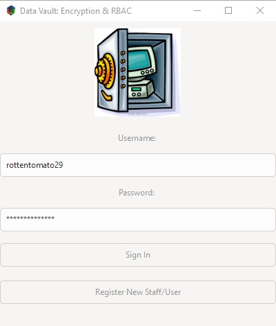
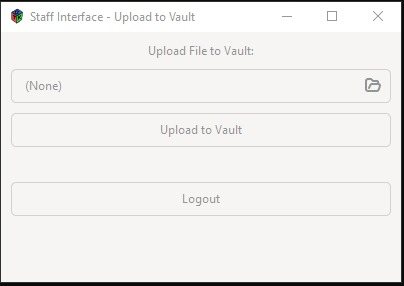
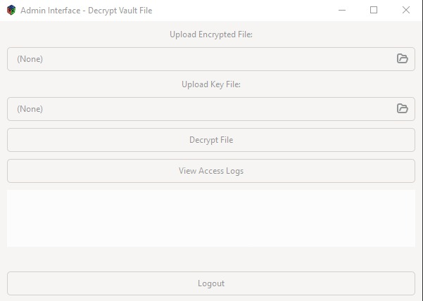
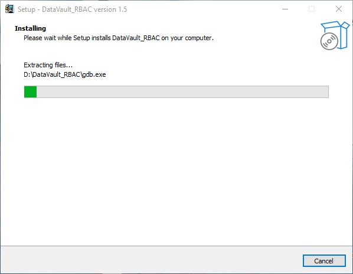

# Data Vault: File Encryption with Role-Based Access Control

A GTK3 desktop application for secure file encryption and storage management, built in C with AES-256-CBC encryption and a two-tier role-based access control system.

---

## Screenshots

### Login


### Staff Interface


### Admin Interface


### Installer


---

## Overview

Data Vault implements a staff/admin workflow where staff members encrypt sensitive files into a vault, and only admins can decrypt them. Every encryption operation is logged to an audit trail with timestamps.

---

## Features

### Core
- AES-256-CBC encryption via OpenSSL EVP
- Role-Based Access Control: separate interfaces for **Staff** and **Admin**
- Per-file cryptographically secure random key + IV (`RAND_bytes`)
- User registration and login with password policy enforcement
- CSV audit log of all encryption operations

### Staff
- Select any file and encrypt it with one click
- Original file deleted after successful encryption
- Encrypted file and key saved alongside original location

### Admin
- Decrypt any vault file given the encrypted file + its `.key` file
- View full access log with usernames and timestamps

---

## Security Details

**Password policy**
- Minimum 8 characters
- At least 1 special character (non-alphanumeric)

**Encryption**
- Algorithm: AES-256-CBC
- Key: 32 bytes, generated via OpenSSL `RAND_bytes` (CSPRNG)
- IV: 16 bytes, generated via OpenSSL `RAND_bytes` (CSPRNG)
- Padding: PKCS7 (handled by EVP)
- Streaming: 4096-byte chunks — handles arbitrarily large files

**Key storage**
- Key and IV are concatenated (48 bytes total) and saved to a `.key` file
- Key file is named after the encrypted output: `filename_encrypted.ext.key`
- Keep the `.key` file separate from the encrypted file for actual security

**Known limitations**
- Passwords stored in plaintext in `userda.txt` — demo only, not production
- No ciphertext authentication (CBC without HMAC — tampered ciphertext won't be detected)
- `remove()` is not a secure wipe — bytes may persist on disk until overwritten
- `applink.c` is Windows-only — Linux builds should exclude it

---

## File Naming Convention

| Operation | Input | Output |
|-----------|-------|--------|
| Encrypt | `report.pdf` | `report_encrypted.pdf` + `report_encrypted.pdf.key` |
| Decrypt | `report_encrypted.pdf` | `report_decrypted.pdf` |

If the file has no extension, `_encrypted` / `_decrypted` is appended directly.

---

## Installation

### Windows (End Users)
No prerequisites. Download and run the Inno Setup `.exe` — all dependencies are bundled.

### Build from Source
**Requirements:** GCC, GTK3, OpenSSL

```bash
gcc main.c enc.c dec.c applink.c -o datavault \
  $(pkg-config --cflags --libs gtk+-3.0) \
  -lssl -lcrypto
```

> On Linux, omit `applink.c` — it is a Windows-only OpenSSL CRT stdio compatibility shim.

---

## Usage

### First Time Setup
1. Launch the application
2. Click **"Register New Staff/User"**
3. Create an **Admin** account (username, password, role: Admin)

### Staff Workflow
1. Login with staff credentials
2. Select a file using the file chooser
3. Click **"Upload to Vault"**
4. File is encrypted, original is deleted, `.key` file is saved

### Admin Workflow
1. Login with admin credentials
2. **Decrypt:** Select the `_encrypted` file and its `.key` file → click **"Decrypt File"**
3. **Audit:** Click **"View Access Logs"** to review all operations

---

## Repository Structure

```
datavault/
├── main.c          # GTK3 UI — login, register, staff window, admin window
├── enc.c           # AES-256-CBC encryption, key generation, filename logic
├── enc.h
├── dec.c           # AES-256-CBC decryption, output filename logic
├── dec.h
├── applink.c       # Windows-only OpenSSL CRT stdio compatibility shim
├── logo.png        # Application logo
├── userda.txt      # User credentials (created on first register)
└── access_log.csv  # Audit log (created on first encryption)
```

---

## Audit Log Format

```
username,filename,timestamp
staff1,report.pdf,15-04-2025 10:22:31
```

---

## Encryption Flow (enc.c)

1. Generate 32-byte key + 16-byte IV via `RAND_bytes`
2. Write key + IV to `filename_encrypted.ext.key`
3. Encrypt input in 4096-byte chunks with `EVP_EncryptUpdate`
4. Finalize with `EVP_EncryptFinal_ex` (PKCS7 padding)
5. Original file deleted by caller

## Decryption Flow (dec.c)

1. Read 32-byte key + 16-byte IV from `.key` file
2. Derive output filename: replace `_encrypted` with `_decrypted`, preserve extension
3. Decrypt in 4096-byte chunks with `EVP_DecryptUpdate`
4. Finalize with `EVP_DecryptFinal_ex`

---

## Future Improvements

- [ ] Argon2/bcrypt for password hashing
- [ ] AES-GCM for authenticated encryption (replaces CBC + standalone HMAC)
- [ ] Secure file wipe (overwrite before unlink)
- [ ] Batch encryption
- [ ] Database backend for user management
- [ ] Multi-factor authentication

---

## License

No License / All Rights Reserved

## Author

Chiranth D Nandi
